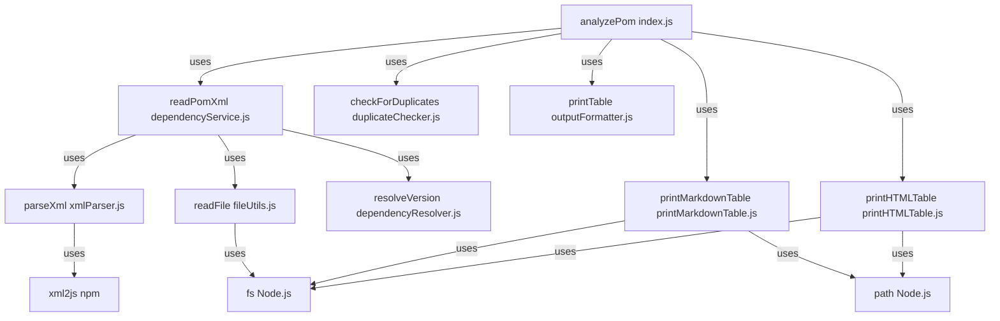

# Dependency Diagram

```mermaid
graph TD
    A[analyzePom index.js] -->|uses| B[readPomXml dependencyService.js]
    B -->|uses| C[readFile fileUtils.js]
    B -->|uses| D[parseXml xmlParser.js]
    B -->|uses| E[resolveVersion dependencyResolver.js]
    A -->|uses| F[checkForDuplicates duplicateChecker.js]
    A -->|uses| G[printTable outputFormatter.js]
    A -->|uses| H[printHTMLTable printHTMLTable.js]
    A -->|uses| I[printMarkdownTable printMarkdownTable.js]
    H -->|uses| J[fs Node.js]
    H -->|uses| K[path Node.js]
    I -->|uses| J[fs Node.js]
    I -->|uses| K[path Node.js]
    C -->|uses| J[fs Node.js]
    D -->|uses| L[xml2js npm]

```
