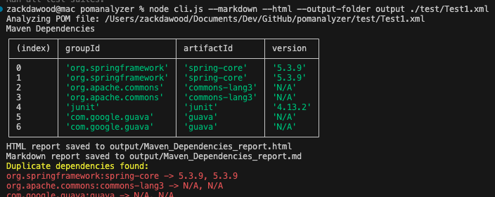
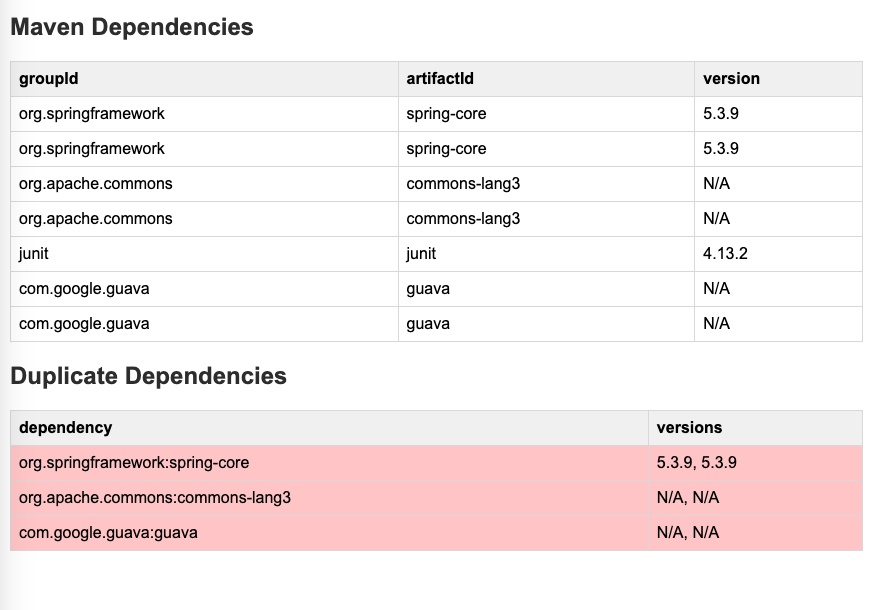
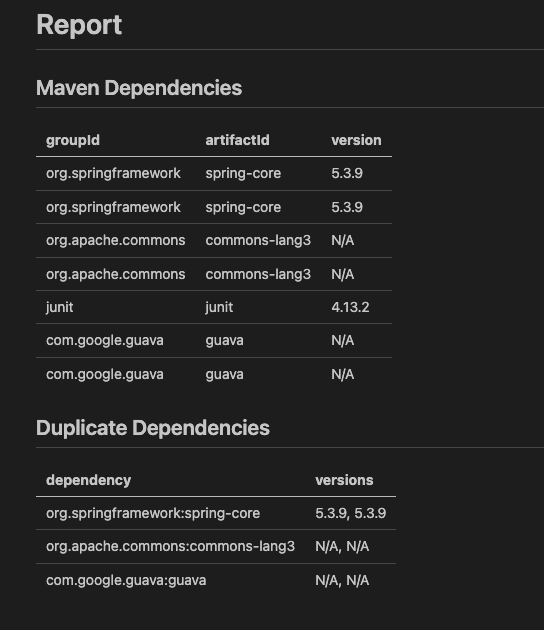
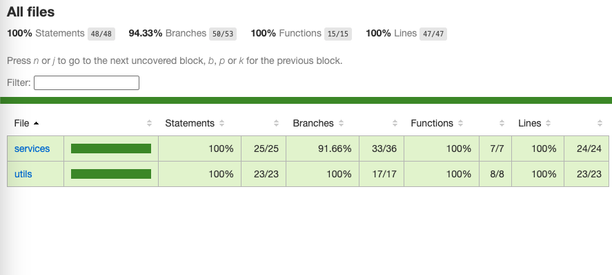

# pomanalyzer

pomanalyzer is a utility to analyze Apache Maven POM XML files offline. It extracts and formats dependency information, detects duplicate dependencies, and generates reports in various formats.

[](https://www.npmjs.com/package/pomanalyzer)


## Features

- Analyze Maven POM XML files to extract dependency information.
- Detect duplicate dependencies and summarize them.
- Generate reports in:
  - **HTML** format.
  - **Markdown** format.
- Customizable output folder for generated reports.


## Installation using NPM 

```bash
# Install globally
npm install -g pomanalyzer

# To uninstall
npm uninstall -g pomanalyzer
```

## Installation in local

To install `pomanalyzer`, clone the repository and install the dependencies:

```bash
git clone https://github.com/zackria/pomanalyzer.git
cd pomanalyzer
npm install
```

## Usage

Run the `pomanalyzer` CLI tool with the following commands:

### Basic Analysis

Analyze a POM file and display the dependencies in the console:

```bash
pomanalyzer <pom.xmlfilepath>
```

### Generate HTML Report

Generate an HTML report of the dependencies:

```bash
pomanalyzer --html <pom.xmlfilepath>
```

### Generate Markdown Report

Generate a Markdown report of the dependencies:

```bash
pomanalyzer --markdown <pom.xmlfilepath>
```

### Generate Both HTML and Markdown Reports

Generate both HTML and Markdown reports:

```bash
pomanalyzer --markdown --html <pom.xmlfilepath>
```

### Specify Output Folder

Generate reports and save them to a specific output folder:

```bash
pomanalyzer --markdown --html --output-folder output <pom.xmlfilepath>
```

## Example Output

### Console Output

```plaintext
Analyzing POM file: <pom.xmlfilepath>
Maven Dependencies:
| Group ID       | Artifact ID    | Version  |
|----------------|----------------|----------|
| org.example    | example-lib    | 1.0.0    |
| org.example    | another-lib    | 2.1.0    |

Duplicate Dependencies:
| Dependency         | Versions       |
|--------------------|----------------|
| org.example:lib    | 1.0.0, 1.1.0   |
```

### HTML and Markdown Reports

Reports are saved in the specified output folder with filenames like:

- `Maven_Dependencies_report.html`
- `Maven_Dependencies_report.md`

## License

This project is licensed under the MIT License. See the [LICENSE](LICENSE) file for details.

## Contributing

Contributions are welcome! Feel free to open issues or submit pull requests to improve the tool.

## Support

For issues or feature requests, please visit the [GitHub Issues](https://github.com/zackria/pomanalyzer/issues) page.

### Example Commands

```bash
pomanalyzer ./test/Test1.xml
pomanalyzer --html ./test/Test1.xml
pomanalyzer --markdown ./test/Test1.xml
pomanalyzer --markdown --html ./test/Test1.xml
pomanalyzer --markdown --html --output-folder output ./test/Test1.xml
```


## Report Examples

### Terminal View


### HTML View


### Markdown View


## Quality Assurance

This package is thoroughly tested with over 90% code coverage to ensure reliability.



## Documentation

For more detailed information, please check the [Documentation](DOCUMENTATION.md).

## Compatibility

Developed and tested with:
- npm v11.1.0
- Node.js v22.13.0

